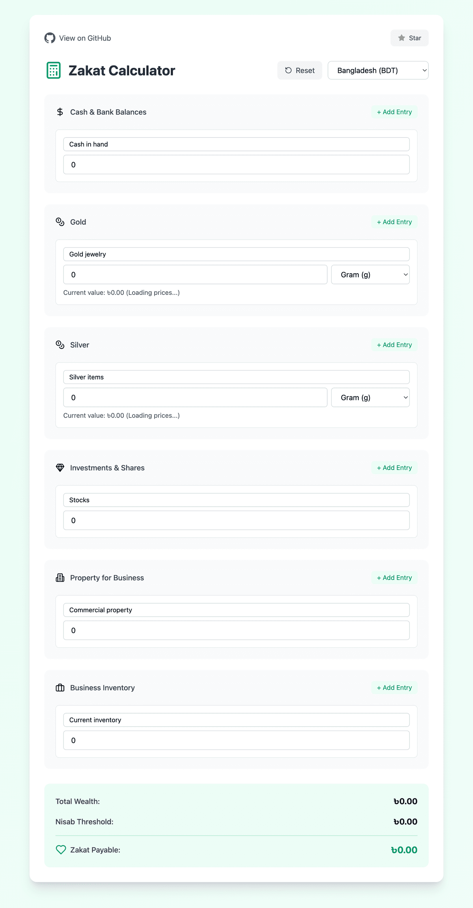
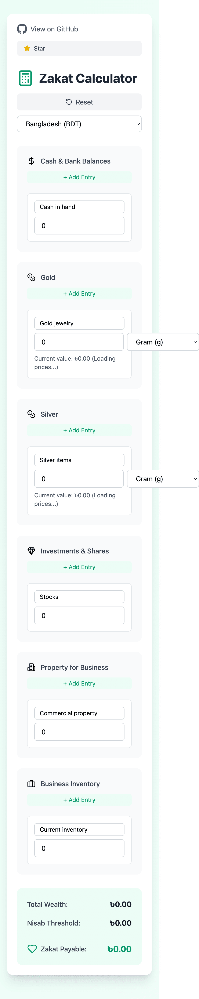

# Zakat Calculator

A modern, user-friendly Zakat calculator web application built with React, TypeScript, and Tailwind CSS. Calculate your Zakat accurately and efficiently with our intuitive interface.

## Screenshots

<details>
<summary>View Screenshots</summary>

### Desktop View


### Tablet View


### Mobile View


</details>

## Features

- 🌍 Support for multiple currencies (USD, GBP, EUR, etc.)
- 💰 Real-time gold and silver price updates
- ✨ Simple and intuitive user interface
- 📱 Responsive design that works on all devices
- 🏦 Comprehensive asset tracking:
  - Cash and bank balances
  - Gold and silver (with multiple weight units)
  - Investments and shares
  - Business assets and inventory
  - Property for business
- 🔄 Automatic Nisab threshold calculation
- 💎 Support for different gold/silver units (grams, troy ounces, vori, etc.)
- 🖩 Real-time calculation updates

## Tech Stack

- React 18 with TypeScript
- Tailwind CSS for styling
- Vite for build tooling
- Currency.js for precise calculations
- Lucide Icons for beautiful UI elements
- Real-time metals price API integration

## Getting Started

### Prerequisites

- Node.js (v18 or higher)
- npm or yarn

### Installation

1. Clone the repository
```bash
git clone https://github.com/yourusername/zakat.git
cd zakat
```

2. Install dependencies
```bash
npm install
```

3. Start the development server
```bash
npm run dev
```

4. Build for production
```bash
npm run build
```

## Usage

1. Select your preferred currency from the dropdown
2. Enter your assets in the provided input fields:
   - Add cash and bank balances
   - Input gold/silver weights with appropriate units
   - Include investments and business assets
3. The calculator will automatically compute your Zakat
4. Results are displayed in real-time as you input values

## Contributing

Contributions are welcome! Please feel free to submit a Pull Request. For major changes, please open an issue first to discuss what you would like to change.

1. Fork the project
2. Create your feature branch (`git checkout -b feature/AmazingFeature`)
3. Commit your changes (`git commit -m 'Add some AmazingFeature'`)
4. Push to the branch (`git push origin feature/AmazingFeature`)
5. Open a Pull Request

## License

This project is licensed under the MIT License - see the [LICENSE](LICENSE) file for details.

## Credits

- Gold and silver prices provided by [Metals.Live API](https://metals.live)
- Currency conversion rates from [ExchangeRate-API](https://www.exchangerate-api.com)
- Icons from [Lucide Icons](https://lucide.dev)
- Built with [React](https://reactjs.org/), [TypeScript](https://www.typescriptlang.org/), and [Tailwind CSS](https://tailwindcss.com/)
- Inspired by traditional Zakat calculation methods and modern financial tools

## Support

If you find this project helpful, please consider:
- Starring the repository ⭐
- Sharing it with others who might find it useful
- Contributing to its improvement
- Reporting any issues you encounter

## Disclaimer

This calculator is provided as a tool to assist in Zakat calculations. For definitive rulings on Zakat, please consult with qualified Islamic scholars or your local mosque.